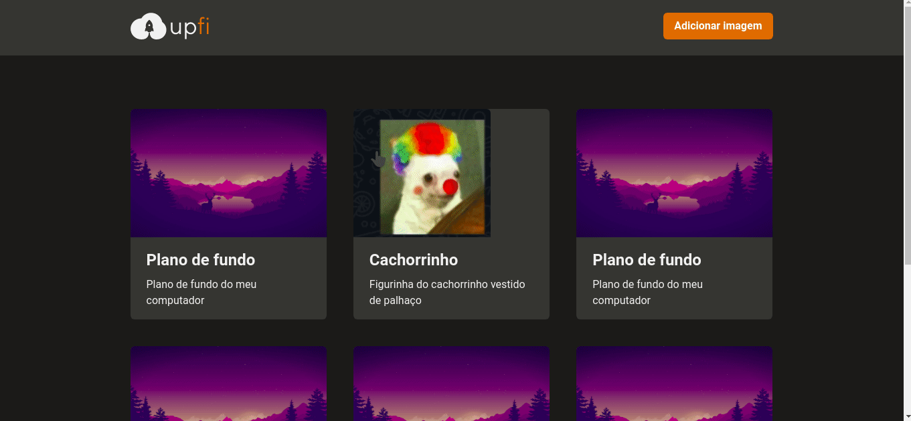

<h1 align="center">
   
</h1>
<h1 align="center" widht="50%">
  
  
  
  
</h1>

## ⚡️ The Project
 Upfi is a NextJS aplication where you can see and post images.
  
## 🎯 Features
 - Front-end Cashe
 - Chackra UI 
 - Api comunnication with Axios
 - Inteligent forms                                                                                        
  
## 🖥️ Used Tecnologies
 - [NextJS](https://nextjs.org/)
 - [Chakra UI](https://chakra-ui.com/)
 - [React-Hook-Form](https://react-hook-form.com/)
 - [React Query](https://react-query.tanstack.com/)
 
## ⚙️ Dependencies
 - [Yarn](https://yarnpkg.com/)
 
## 🚀️ Getting Started

1. Clone this repository: 

```bash
git clone https://github.com/avnerjose/reactjs-nextjs-ignite-challenge-upfi.git && cd reactjs-nextjs-ignite-challenge-upfi
```
2. Install all dependencies

```bash
yarn
```
3. Start the app
```bash
yarn dev
```
4. Open [localhost:3000](http://localhost:3000) to see the app working
